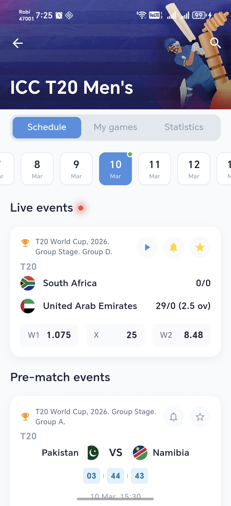
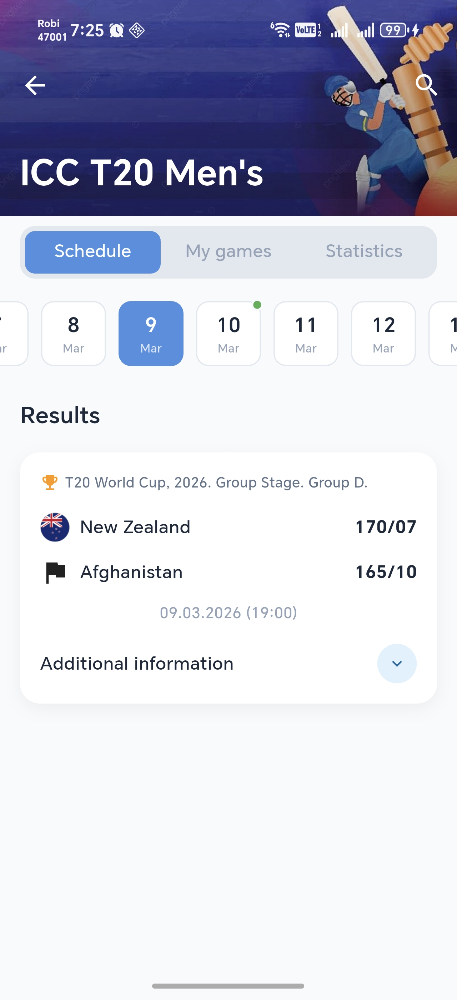
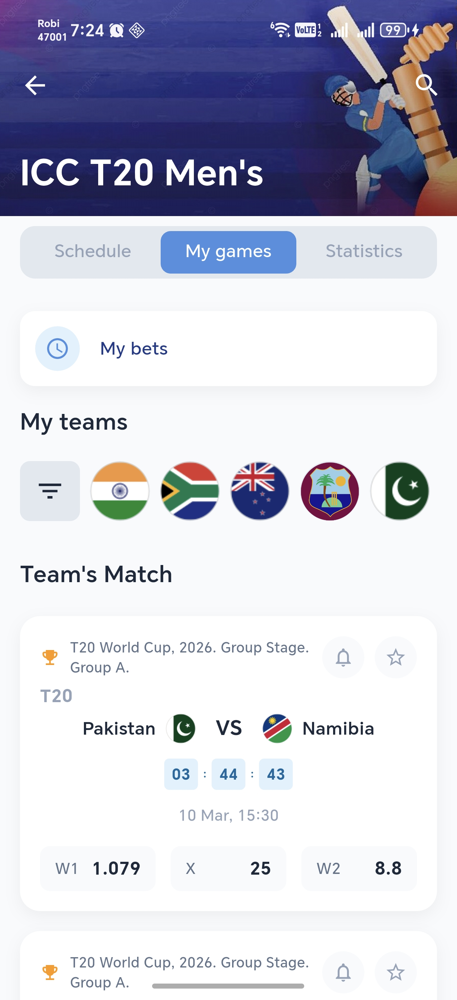
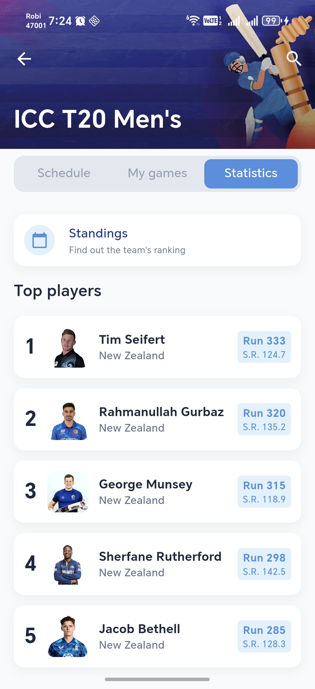

# Sports UI Reconstruction 🏆

A high-performance, pixel-perfect Flutter application demonstrating advanced UI reconstruction, robust state management with BLoC, and persistent local storage.

## 🚀 Project Overview
This project focuses on recreating a complex sports match schedule and statistics UI with a focus on responsiveness, micro-animations, and clean architecture. It includes features like:
- **Dynamic Scheduling**: View live, upcoming, and finished matches with date-based filtering.
- **My Games**: A persistent favorite system to track specific matches.
- **Player Statistics**: Detailed rankings with professional formatting and avatar integration.
- **Responsive Layout**: Utilizing `NestedScrollView` and `SliverAppBar` for a premium collapsing header experience.

## 🛠 Technical Stack
- **Framework**: [Flutter](https://flutter.dev)
- **State Management**: [flutter_bloc](https://pub.dev/packages/flutter_bloc) (BLoC Pattern)
- **Local Storage**: [Hive](https://pub.dev/packages/hive) (NoSQL Database for high-performance persistence)
- **Dependency Injection**: [get_it](https://pub.dev/packages/get_it) (Service Locator for clean separation)
- **Networking**: [Dio](https://pub.dev/packages/dio) (Robust HTTP client, used for mock data orchestration)
- **Utilities**: `intl` (Date formatting), `equatable` (Value equality), `cached_network_image` (Image caching)

## 📁 Project Structure & Approaches
The project adheres to a **Layered Clean Architecture** to ensure modularity and ease of maintenance.

### Architecture Layers:
1. **Presentation Layer**: 
   - **BLoC**: `SportsBloc` manages all application states (Loading, Loaded, Error).
   - **Widgets**: Atomic component design (e.g., `MatchCard`, `InfoCard`, `PlayerStatCard`) for reusability.
   - **Pages**: `SportsPage` acts as the main orchestrator for the feature.
2. **Domain Layer**: 
   - **Entities**: Plain Dart objects like `MatchEvent` and `PlayerStat`.
   - **Repositories**: Abstract definitions of data operations.
3. **Data Layer**: 
   - **Models**: Extensions of entities with JSON serialization support.
   - **Data Sources**: `SportsRemoteDataSource` (fetch logic) and `SportsLocalDataSource` (Hive persistence).

## 🤖 Generative AI Usage
This project leveraged **Antigravity (Google DeepMind)** as a sophisticated pair-programmer and architectural auditor.

### How it was used:
- **UI Auditing**: Iterative visual checks to align the implementation with reference screenshots.
- **Refactoring**: Transforming a monolithic UI into a highly readable, separated widget structure.
- **Logic Orchestration**: Implementing complex date-based visibility rules for live vs. finished events.

### Essential Prompts:
- *"Recreate the provided UI with pixel-perfect accuracy, focusing on multi-layered UX handling and smooth transitions."*
- *"Implement a clean feature-first architecture using BLoC for state management and Hive for local persistence."*
- *"Refine the tournament header text to strictly follow the format: 'Tournament Name, Year. Stage. Group.' and handle dots gracefully."*
- *"Implement date-based visibility: Live events only on selection of 'Today', 'Results' title for past dates, and 'Pre-match' for future."*

## 🏃 How to Run
1. **Clone the Repo**:
   ```bash
   git clone <repository_url>
   cd ui_reconstruction
   ```
2. **Get Dependencies**:
   ```bash
   flutter pub get
   ```
3. **Generate Code** (for Hive and JSON):
   ```bash
   flutter pub run build_runner build --delete-conflicting-outputs
   ```
4. **Run the App**:
   ```bash
   flutter run --release
   ```

## 📸 Screenshots
| Schedule (Today) | Schedule (Past/Results) | My Games | Statistics |
| :---: | :---: | :---: | :---: |
|  |  |  |  |

## 📦 Release APK
The project is built and optimized for release. You can download the latest APK here:

**[Download Release APK](https://example.com/download/ui_reconstruction_v1.apk)** *(Placeholder - Replace with actual link after upload)*

Alternatively, build it locally:
```bash
flutter build apk --release
```
The output will be found at: `build/app/outputs/flutter-apk/app-release.apk`

---
*Built with ❤️ for Technical Assessment.*
